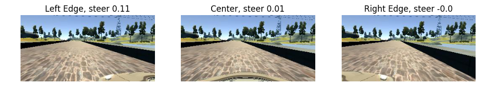
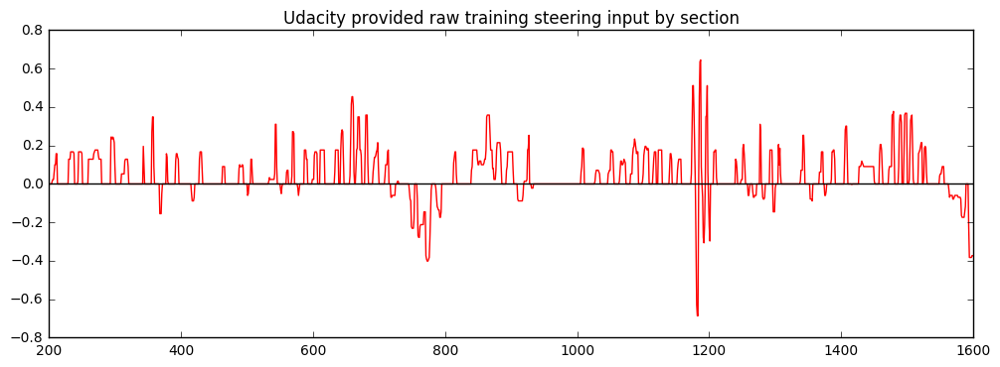
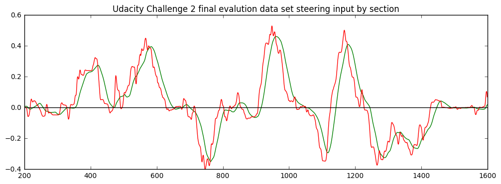
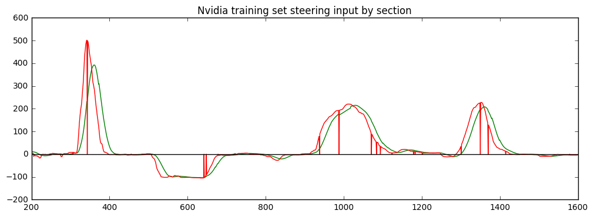
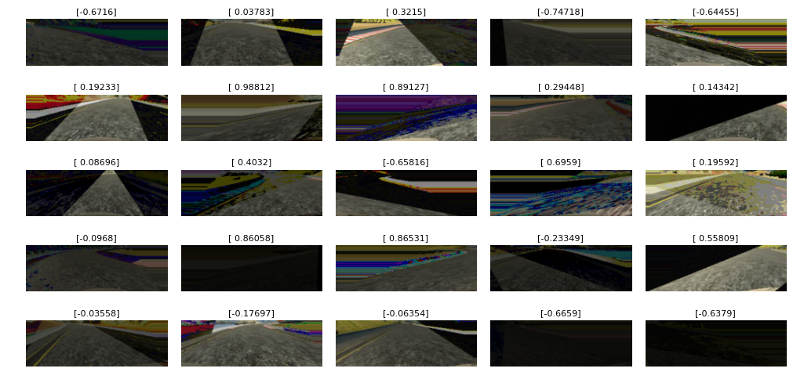

# Behavioral Cloning: 
##The taste of self-driving Car in a Simulator

### Overview

The objective: Use Deep Learning to Clone Driving Behavior

I personly tried drive the car in provided simulator with keyboard. It took me a while to get used to the track 1, and saved  some images for exporation. Udacity also provided [prefessional driver records](https://www.youtube.com/watch?v=tMs6NUHAy80) for better results. On track one, the [model driving skill](https://www.youtube.com/watch?v=eFpnKPBd5ts) is better than me now. I have broken down the project scope into the following modules:

- Explorting the data (data_visualization.ipynb)
- Data Processing Pipeline (utility.py)
- Deep Learning Model Architecture Design (model.py)
- Model Architecture Characteristics
- Model Training (Include hyperparameter tuning) 
- Results / Driving fine tune (drive.py)
- Lessions Learned
- Future Work

First, let's talk about the computer setup. I have run the training cycle and driving cycle on CPU. It is quite hard on the machine. I have Dell T3500 workstation with 12G ram and 8 core CPU run on Linux Ubuntu 14.04. 

### Dependencies

This project requires **Python 3.5** and the following Python libraries installed:

- [Keras](https://keras.io/)
- [NumPy](http://www.numpy.org/)
- [SciPy](https://www.scipy.org/)
- [TensorFlow](http://tensorflow.org)
- [Pandas](http://pandas.pydata.org/)
- [OpenCV](http://opencv.org/)
- [Matplotlib](http://matplotlib.org/) (Optional)
- [Jupyter](http://jupyter.org/) (Optional)

Run this command at the terminal prompt to install [OpenCV](http://opencv.org/). Useful for image processing:

- `conda install -c https://conda.anaconda.org/menpo opencv3`

### How to Run the Model

This repository comes with trained model which you can directly test using the following command.
Make sure the drive_log.csv is attached in the ./data/ path.
- `python drive.py model.json`

## Implementation

### Explorting the data

First of all, we may want to see what is captured in the [Udacity data set](https://www.youtube.com/watch?v=tMs6NUHAy80). The driver drove through the track 1 backward and forward few times. For every given time stamp, there are 3 images recorded from left, center, and right cameras. 
<p align="center">
 
</p>
One steering angle value, throttle, brake, speed also recorded in the driving_log.csv file. 
First plot is my keyboard driving inputs.
<p align="center">
 
</p>
Second plot is Udacity provided driving inputs. I believe it already smooth out. 
<p align="center">
 
</p>
Next plot is Udacity Open Source Car Challenge Two real human driving inputs.
<p align="center">
 
</p>
Next plot is Nvidia paper real human driving inputs.
<p align="center">
 
</p>

The first thing I want to do is to apply a moving average to the input and smooth out the steering action. The green line shows 30 frams averaged outputs. Because I never turn the steering wheel like keyboard driver does. 
<p align="center">
 <iframe width="1280" height="720" src="https://www.youtube.com/embed/tMs6NUHAy80" frameborder="0" allowfullscreen></iframe>
</p>
### Data Analysis

There are total 24108 images (8036 images per camera), along with 8036 steering records in the Udacity dataset. Compare to Nvidia sample set 40,000 images one channel, this is very small, may not have enough image to generalize the model weight in order to pass the training course or other unseen courses. Image Augmentation Technique is recommand by Udacity and other student's post. I tried many of them, and I choose the following to form the image processing pipeline. 
- Random adjust the image brighnest/darkness
- Flip the image and steering angle together
- Random mask some area of the image, create shadow effect
- Random shear
- Lookahead, crop the image center portation out
- Horizontal crop the image center portation out, with shifted steering angle

### Data Processing Pipeline

I use Pandas module to read driving_log.csv, and saved all image file names and steering inputs into lists. I applied 5 frame moving average to the steering angle, and centered the result. The left image assigned the steering angle with right turn offset, the right image assigned with left turn offset. 


### Image Processing Pipeline
A combination of augmentation tools collected from https://github.com/upul, https://medium.com/@mohankarthik/cloning-a-car-to-mimic-human-driving-5c2f7e8d8aff#.kot5rcn4b, https://chatbotslife.com/learning-human-driving-behavior-using-nvidias-neural-network-model-and-image-augmentation-80399360efee#.gix474ksk, Udacity class room and slack channels. 
```
def pipeline(image, steering_angle, top_crop_percent=0.35, bottom_crop_percent=0.1,
                       resize_dim=(64, 64), do_shear_prob=0.9):
    head = bernoulli.rvs(do_shear_prob)
    if head == 1:
        image, steering_angle = random_shear(image, steering_angle)
    image = lookahead_crop(image, top_crop_percent, bottom_crop_percent)
    image = dark_image(image)
    image = mask_image(image)
    image, steering_angle = random_flip(image, steering_angle)
    image = resize(image, resize_dim)
    return image, steering_angle
```
The lookahead_crop is my idea inspired by human driver. When kids start learning how to ride bicycle, one important technique is when you zigzag the handle bar too much, lookup, lookahead, you will find much easier to balance and smooth out. Same thing as driving a car or race car, if you find hard to follow the track, or the lane, look farther, look into the apex, or the vanish point, you will find everything will smooth out. I applied this idea into the code, During training cycle, top_crop_percent is 35%, bottom_crop_percent is 10%. In the driving cycle, the image crop is moving up a few percent, to 30% and 12%. I can fine tune it without retrain the model again. 
<p align="center">
 
</p>

I see lot of students using random shear operation, so I think I will give it a try. I selected 50% of the images will be sheared. It looks like camera in motion. Maybe optical flow and show the real effect, but shear is easier and quick to do. 
<p align="center">
 
</p>

Random darkness function is to adjust the brightness of a image, to make new image look like under a shade. 
Random mask_img function will mask random area of a picture, the new image will look like under a shade and other difficulty visual conditions. The idea is inspired by Udacity project 1. 
```
def mask_image(img):
    """
    Applies an image mask.
    region_of_interest(img, vertices):
    """
    rows,cols,ch = img.shape
    ax = int(cols*(np.random.uniform(-0.5,0.5)))
    bx = int(ax+cols*np.random.uniform(-0.5,0.5))
    cx = int(np.random.uniform(0, 80))
    dx = int(cols-cx)
    p = (np.random.uniform(-0.5,0.5))
    vertices = np.array([[(dx,rows),(ax,int(p*rows)), (bx, int(p*rows)), (cx,rows)]], dtype=np.int32)
    shadow = np.random.randint(1, 200)
    mask = np.full_like(img, shadow)
        
    #defining a 3 channel or 1 channel color to fill the mask with depending on the input image
    if len(img.shape) > 2:
        channel_count = img.shape[2]  # i.e. 3 or 4 depending on your image
        ignore_mask_color = (255,) * channel_count
    else:
        ignore_mask_color = 255
        
    #filling pixels inside the polygon defined by "vertices" with the fill color    
    cv2.fillPoly(mask, vertices, ignore_mask_color)
    
    #returning the image only where mask pixels are nonzero
    masked_image = cv2.bitwise_and(img, mask)
    
    return masked_image
```
The flip function is simple flip the image and steering angle at 50/50 chance. I will consider flip all the images just to double the dataset size. 

According to the model input size(66x200), all images need resize to fit. 
There are more benfit to make a square input, it will explained in the notebook and driving section.

## Model Architecture Design 

NVIDIA's End to End Learning for Self-Driving Cars Network Architecture is popular for this kind of project. Therefore, I want to keep the core architecture of the Nvidia model as much as possible according to the [paper](https://arxiv.org/pdf/1604.07316.pdf), apply all the feature filters for each layer, and use the same stride and padding sittings as Nvidia paper. The original Nvidia has a tenserflow version, I transfered it into Keras environment. My approach is to change one thing at a time, and keep track what kind of structures is working , which one is not working.  

I added Lambda layer to normalize the input image, the image input value(between 0-255)divided by 127.5, then minus 1, yield new value between (-1 to 1). As per Udacity Deep learning class, it is better spread the value around zero, rather than skew to the one side. [Comma Ai](https://github.com/commaai/research/blob/master/train_steering_model.py) also use this idea. 
The input shape I kept as (66, 200, 3). It is smaller than Resnet, AlexNet and VGG (224,224), but much bigger than LeNet (32, 32). Just to balance the training time and system overhead. 

Next is a color space conversion layer, credit to [Vivek's model](https://chatbotslife.com/learning-human-driving-behavior-using-nvidias-neural-network-model-and-image-augmentation-80399360efee#.ykemywxos). The idea is use 3 filter go through 3 color channels, see which one get picked. I don't see a big differecy or benefit about this color space layer yet. 

There are 5 convolutional layers. each one has 24 to 64 filters, all use 'valid' padding, strid of 2 or 1. All activation function use "relu". I have tried 'ELU' before, didn't see good results.    

I do added a MaxPooling layer after first Convolutional layer to see if there is any benefit.  
The full network is look like this: 
```
model = Sequential()
# First Normalize layer, credit to comma ai model
model.add(Lambda(lambda x: x / 127.5 - 1.0, input_shape=(66, 200, 3)))
# Color space conversion layer, credit to Vivek's model
model.add(Convolution2D(3, 1, 1, border_mode='same', name='color_conv'))
# Classic five convolutional, Nvidia model and additional maxpooling layers
model.add(Convolution2D(24, 5, 5, border_mode='valid', activation='relu', subsample=(2, 2)))
model.add(Convolution2D(36, 5, 5, border_mode='valid', activation='relu', subsample=(2, 2)))
model.add(Convolution2D(48, 5, 5, border_mode='valid', activation='relu', subsample=(2, 2)))
model.add(Convolution2D(64, 3, 3, border_mode='valid', activation='relu', subsample=(1, 1)))
model.add(Convolution2D(64, 3, 3, border_mode='valid', activation='relu', subsample=(1, 1)))
model.add(Flatten())
# Next, five fully connected layers
model.add(Dense(1164, activation='relu'))
model.add(Dropout(keep_prob))
model.add(Dense(100, activation='relu'))
model.add(Dense(50, activation='relu'))
model.add(Dense(10, activation='relu'))
model.add(Dense(1))

model.summary()

model.compile(optimizer=Adam(learning_rate), loss="mse" )
```
```
Layer (type)                     Output Shape          Param #     Connected to                     
====================================================================================================
lambda_1 (Lambda)                (None, 66, 200, 3)    0           lambda_input_1[0][0]             
____________________________________________________________________________________________________
color_conv (Convolution2D)       (None, 66, 200, 3)    12          lambda_1[0][0]                   
____________________________________________________________________________________________________
convolution2d_1 (Convolution2D)  (None, 31, 98, 24)    1824        color_conv[0][0]                 
____________________________________________________________________________________________________
maxpooling2d_1 (MaxPooling2D)    (None, 30, 97, 24)    0           convolution2d_1[0][0]            
____________________________________________________________________________________________________
convolution2d_2 (Convolution2D)  (None, 13, 47, 36)    21636       maxpooling2d_1[0][0]             
____________________________________________________________________________________________________
convolution2d_3 (Convolution2D)  (None, 5, 22, 48)     43248       convolution2d_2[0][0]            
____________________________________________________________________________________________________
convolution2d_4 (Convolution2D)  (None, 3, 20, 64)     27712       convolution2d_3[0][0]            
____________________________________________________________________________________________________
convolution2d_5 (Convolution2D)  (None, 1, 18, 64)     36928       convolution2d_4[0][0]            
____________________________________________________________________________________________________
flatten_1 (Flatten)              (None, 1152)          0           convolution2d_5[0][0]            
____________________________________________________________________________________________________
dense_1 (Dense)                  (None, 1164)          1342092     flatten_1[0][0]                  
____________________________________________________________________________________________________
dropout_1 (Dropout)              (None, 1164)          0           dense_1[0][0]                    
____________________________________________________________________________________________________
dense_2 (Dense)                  (None, 100)           116500      dropout_1[0][0]                  
____________________________________________________________________________________________________
dense_3 (Dense)                  (None, 50)            5050        dense_2[0][0]                    
____________________________________________________________________________________________________
dense_4 (Dense)                  (None, 10)            510         dense_3[0][0]                    
____________________________________________________________________________________________________
dense_5 (Dense)                  (None, 1)             11          dense_4[0][0]                    
====================================================================================================
Total params: 1,595,523
Trainable params: 1,595,523
Non-trainable params: 0
```
There are 1,595,523 total/trainable parameters came out of this model. Nvidia paper stated only 250k parameters. 

The 5 convolutional layer shrink down layer by layer as per the plan, because I am using the 'valid' padding, until it reach 64@1x18. Then I flatten the 64 layers down, get 64x1x18 = 1152 connectors. 

Then follow by 5 fully connected layers. The first dense layer has 1164 connectors, therefore, between flatten layer and dense_1 layer has 1152x1164+1164 = 1342092 connections. Activation function is 'relu' again. 

Some architecture apply to all fully connected network, only the output layer with one output, no activation funcion. 

Dropout is aplied after dense_1 layer. Not changing in parameters, but will provent some overfitting. 

I tried some smaller network, 64x64, 300k params, cut down training time by one third, result is ok, not that great. 
So I didn't use them.  

## Model Architecture Characteristics

I think this is a mid-size network, enough parameters to save the weight and biases for the courses in simulator, and some real world challenges, such as the Udacity self driving car challenge two. I am going to apply this network on it later. 

Keras version seems run faster than the direct tensorflow version on CPU. I run through 40 epochs on 19200 images, total 768k images for about 2 hours on CPU. Original Nvidia model run through 1300k images for 2 hours on GPU. 

The network model use adam as optimizer, with learning rate 0.001. The loss function use "MSE". The starter loss is around 0.2 - 0.5. Then drop to 0.1-ish after 1 epoch. Then drop slowly. About 10 epoches, it reaches 0.04, 20 epoches, 0.03, 40 epoches, 0.028-ish. From 0.04 to 0.03, the model is able to run through track 1, 0.028, it can run through [track 2](https://www.youtube.com/watch?v=mwniaaC-1fQ) beatuifully, but getting worst on track 1, maybe that is overfitting issue.  
I can add more maxpooling and dropout layers.

## Training Strategy

As requested, fit_generator function is used to generate images while training the model. The model only allow to see track one many times, track 2 is never seem. Track 1 is sunny, bright, and flat course. The challenge could be the white out, small shadow on the road,and bridge. Track 2 is dark, shadow, steep hill, and curve, everything is unknown. The provided data set has 8000 images from each camera, all facing forward, left, center and right. I can use all, but still not enough. Additional augmentation is needed. We can use generator to produce augmentated images on the fly to training the model.   

I implementated two generators, one for training batch, one for validation batch:
```
def generate_train_batch(batch_size=64):
    # Generate train batch data on the fly, yield array file format.
    while True:
        X_batch = []
        y_batch = []
        #images = get_train_image_files(batch_size)
        files = get_train_batch_data(batch_size)
        raw_angle = files[1]
        i = 0       
        for img_file in files[0]:
            #Read all images and angles in the batch and go through image process pipeline
            raw_image = scipy.misc.imread(img_path + img_file)
            new_image, new_angle = pipeline(raw_image, amp_factor*raw_angle[i])
            X_batch.append(new_image)
            y_batch.append(new_angle)
            i += 1

        yield np.array(X_batch), np.array(y_batch)
```
Due to the moving average calculation, the steering value at the begining and end of the list is bad. So I clipped of the end, only take [200:8000] and merge into X_all for image file names, and y_all for steering values. The shuffle and split the dataset into train and validation subset. Function get_train_image_files() will loop through the train set, every image will be used. Every trainning image go through the pipeline once, randomly sheared, darkning, flipped, shifted, then resize to fit (66, 200) window, with 64 images per batch. It is possible to generate more than once in the pipeline, to make 2x, 4x or more images per batch. I choose to keep it as one and increase the epoch number form 10 to 40. 

The validation generater yields straight images from reserved validation set, no augmentation. Somehow the validation loss is quite high, around 0.1-0.14. But it don't affect the final test result. Maybe I can take more images into training set.  

The Adam learning rate is 0.001, I can see the training loss improving quickly on epoch 1 -2, than flat out. So I maybe can try add more dropout to check results, then add more maxpooling, then reduce the learning rate to provent local optimal.   

### Results

In this project, 20 epochs seems enough to drop the loss to 0.037-ish range. [it can handle the training track](https://www.youtube.com/watch?v=eFpnKPBd5ts&t=2s). The training slows down at about 15 epoch. There are more tune up can be done to make it drive smoothly and safely. More training seems overfitted the model on track 1. Or the machine pick up the bad driver's behavioral from human. The submitted model.h5 and model.json is trained on 20 epoches.      

40 epochs is the kicker, with training loss at 0.295, the machine can [pass the mountain track 2](https://www.youtube.com/watch?v=mwniaaC-1fQ&t=16s). It is a totally unknown track for the computer. The machine only see batch of augmentated images, some are not even recognizable by human. And they are low resulation, the car's life depends on 66x200 pictures. 
<p align="center">
 
</p>
Anyway, the car drives to the top, the road block. 

### Driving fine tune

As the model.py completed the training cycle, the frash model may or may not working on the track. I did few tune-ups as following: 
- Moving average
- Weight and bias for the steering output
- Lookahead, look up
- Smart throttle

Three frame moving average also applied to the predicted steering angle. The moving window can be set between 3-10. The more window will delate the steering action. 

The weight factor 1.1 is to offset the average loss on the steering peak value, and and a small bias 0.05 is to offset the training defect, if the car always turn to one side. One case, I can [keep the car on the right side](https://www.youtube.com/watch?v=nLKzVSWgKWI&t=1s).  
```
smooth_angle=np.mean(moving_avg)*1.1-0.05
```
Small amount 1% of lookahead(lookup) is applied to the driving image processing pipeline, compare to the training image processing setting 0.35 and 0.1. 
```
image_array = utility.lookahead_crop(image_array, 0.34, 0.12)
```
At high speed, the car sometime run into overshooting situation. The car make sharp turn, over corrected, make sharp turn to another direction. I think apply PID control can correct it. Also reduce the speed can help as well. I choose an easy solution, if the car want to make sharp turn at high speed, reduce the throttle: 
```
if abs(float(current_steering_angle)*float(speed)) ==0:
        throttle = 0.3
    else:
        throttle = 0.3*12/abs(float(current_steering_angle)*float(speed))
```
As result, the car can reach top speed 30mph, it also can keep on the track. 

On track 2, because of the steep hill, I need give more throttle to keep up. 
```
        throttle = 0.3*12/abs(float(current_steering_angle)*float(speed))
```
Maybe I should group the drive.py into higher level controlling method for further developing. It is more about the decision making, speed, direction, and change lane, etc. Neural network can handle the low level reaction type of work. 

### Lessons Learned/Reflection

While the car keep running in the simulator, I can prepare the document for the submission. This is the self driving car future we are looking for. We need overcome some obstacles: 
- Better training data
- More compute power
- Standardize Network Architecture
- It is a try and error approach, and engineering approach
- Working on real environment

### Future Work
The Udacity provided training data is not too bad. It does have some bad turns. And the model clones them. It is perfecty matched the title "behavioral clone". If you are good driver, it clones. If you are bad driver, it clones too. 
I think somehow it is hard to figure out who is better driver, human or machine.  

In the begining, I don't like this kind of sharp on and off keyboard driving input. Later, I found out the udacity dataset is already smoothed, or at least is joystick or wheeled controller input. I thought a smooth steering curve is better for the training, but it turn out not really the case. Over smoothed curve yield very aggressive turnning. Maybe it is a very good result, we just need fine tune the controller to handle it properly. Also, in the real world, most of the time, the steering wheel is in netural position. Train the machine not to over react is harder than keep moving. 

190 seconds to train 19200 66x200 size images on CPU, is not that bad. Somehow I find the GPU is not working as hard as I expected in the generator setting. Both my GTX 1070 or K2000 GPU Utilization is very low, less than 4-30%. On normal tensorflow test, the GPU get at lease 3-10 times faster than CPU. I guess the bottle neck maybe is the generator. During training or driving, the RAM memory useage is less than 2.8G, It doesn't make sense to save memory but spend more time waiting for results. After tried different network architecture, Nvidia, Comma AI and my home made one, I like the Nvidia one. I hope they can standardize it, and provide with trained weights as well. Transfer learning has huge benefit for machine learning.

I find the simulator also provide real time steering_angle, throttle, speed and image feed. Therefore, it is possible to record new training set driving by the machine. Then train the machine again. After few generation, the machine driver will be better than human. I am going to explore more about the reinforcement learning. 

### Acknowledgements

There are many online resources available and helpful for this project. Thank you everyone to share them to the world. 
-  https://medium.com/@mohankarthik/cloning-a-car-to-mimic-human-driving-5c2f7e8d8aff#.kot5rcn4b
-  https://medium.com/@ksakmann/behavioral-cloning-make-a-car-drive-like-yourself-dc6021152713#.dttvi1ki4
-  https://chatbotslife.com/learning-human-driving-behavior-using-nvidias-neural-network-model-and-image-augmentation-80399360efee#.ykemywxos
-  https://github.com/upul/behavioral_cloning
-  https://review.udacity.com/
-  http://stackoverflow.com/questions/1756096/understanding-generators-in-python
-  http://www.pyimagesearch.com/2015/10/05/opencv-gamma-correction/
-  The model is based on NVIDIA's "End to End Learning for Self-Driving Cars" paper
-  Source:  https://arxiv.org/pdf/1604.07316.pdf
-  https://github.com/mvpcom/Udacity-CarND-Project-3
-  https://github.com/karolmajek/BehavioralCloning-CarSteering
-  https://github.com/commaai/research/blob/master/train_steering_model.py
-  and many many comments in slack channels. 
